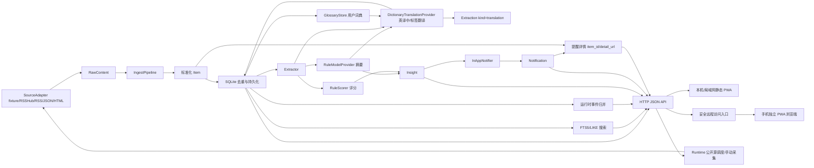

# Signal Harbor MVP 架构说明

## 1. 当前形态

当前 MVP 采用“单进程后端 + SQLite + 静态 PWA”的本机自托管形态。后续移动端目标是在保留本机后端的前提下，增加受保护远程访问入口，让 Android 手机不必只依赖同一局域网访问。第一轮重点不是扩展信息源数量，而是验证主链路是否稳定：

1. SourceAdapter 读取低风险 fixture 文本源、RSSHub 派生 RSS 源或 RSS/JSON/静态 HTML 公开源。
2. Pipeline 将原始内容标准化为 Item。
3. SQLiteStore 按 canonical hash 去重并记录任务状态。
4. Extractor 提取正文、实体、风险词和证据线索。
5. ModelProvider 生成规则摘要。
6. TranslationProvider 对英文信息源生成本地词典翻译结果。
7. Scorer 输出价值评分和信号。
8. Notifier 写入站内消息。
9. Storage 使用 FTS5 优先、LIKE fallback 的搜索能力提供多条件检索，并通过 `backend/signal_harbor/events.py` 在读取 latest/search/detail/notifications 时运行时计算同事件归并字段。
10. Runtime 层提供公开源启动采集、手动采集、后台定时采集和运行状态汇总；采集任务使用独立 SQLite 连接并串行化，避免和 HTTP 请求共享同一连接写入。
11. API 将最新流、搜索、详情、收藏、专题、观察清单、保存搜索、运行状态和提醒记录提供给前端；同一事件的多来源报道以增量字段形式返回，不删除旧字段。
12. 静态 PWA 在桌面和 Android 手机浏览器中消费 API，并提供保存搜索、收藏、加入专题、提醒规则管理、翻译管理、运行状态、手动公开源采集、英文源中文辅助阅读和弱网提示。
13. 安全远程访问入口在需要时将手机端请求转发到本机后端；未补访问保护前，不允许直接把后端端口暴露到公网。

## 2. 数据流

## 3. 模块边界

### 3.1 SourceAdapter

位置：`backend/signal_harbor/adapters/`

职责：

- `discover()`：发现待采集入口。
- `fetch()`：读取原始内容。
- `parse()`：转成 RawContent。
- `normalize()`：做来源内的轻量清洗。
- `collect()`：串联发现、读取、解析、清洗。

当前实现：

- `FixtureSourceAdapter`：读取 `config/fixtures/items.json`，用于低风险可重复验证。
- `RssSourceAdapter`：读取 RSS/XML 公开源，解析 item/entry 为 RawContent。
- `JsonSourceAdapter`：读取 JSON 公开源，通过 `json_mapping` 字段映射解析 RawContent。
- `HtmlSourceAdapter`：读取公开静态 HTML 列表页或论坛页，通过 `html_mapping` 字段映射解析 RawContent，可选抓取详情页正文。
- `RssHubSourceAdapter`：读取本机或可信 RSSHub 实例输出的公开 RSS route，先检查 `/healthz`，再复用 RSS 解析和后续采集链路。

后续扩展：

- B 站字幕/视频元信息适配器。
- 登录态平台适配器应放到 Phase 2，并单独处理凭据、限频、失败退避。

公开源配置：

- 配置文件示例位于 `config/sources.example.json`。个人本机真实来源配置使用 `config/sources.local.json`，该文件默认不提交；迁移或新环境可从 `config/sources.local.example.json` 复制后按需启用。
- RSS 源使用 `name`、`type=rss`、`url`、`tags`、`enabled`、`fetch_interval_minutes`。
- JSON 源额外使用 `json_mapping`，支持 `items_path`、`title`、`text`、`url`、`published_at`、`author`、`tags`。
- HTML 源额外使用 `html_mapping`，支持 `items`、`title`、`text`、`url`、`published_at`、`author`、`tags`、`fetch_detail`、`detail_text`、`base_url`。
- `scripts/ingest_public_sources.py` 会跳过 `enabled=false` 的源，并将每个启用源独立写入 TaskRun。

RSSHub 适配边界：

- RSSHub 是外部上游服务或同级本机项目，Signal Harbor 不把 RSSHub 的 Node/TypeScript 依赖、路由实现和缓存系统并入 Python 后端。
- `type=rsshub` 是配置糖：用 `rsshub_base_url` + `rsshub_route` 生成最终 RSS URL，并保留 `type=rss` 的向后兼容能力。
- RSSHub 采集前可检查 `rsshub_healthcheck_path`，默认 `/healthz` 返回 `ok` 才继续抓取 route。
- RSSHub route 的失败隔离到单个 Source/TaskRun：实例不可达、健康检查失败、route 404、空 feed、非 RSS 响应、上游被限制访问，都不能影响其他来源。
- 同级 `../RSSHub` 目录可作为本机 RSSHub 实例来源；`config/sources.local.example.json` 提供默认关闭的首批候选 route：`/wallstreetcn/live/global/2`、`/cls/telegraph/red`、`/jin10/important`、`/10jqka/realtimenews/重要`、`/dw/rss/rss-chi-all`。其中中文 route 会在生成最终 URL 时做百分号编码，实际启用状态以用户本机 `config/sources.local.json` 为准。
- 需要登录、Cookie、验证码、JS 渲染、浏览器自动化或规避反爬的 route 不作为当前 Signal Harbor 适配目标。

HTML 公开源边界：

- 只处理公开、无需登录、无需 Cookie、无需验证码、无需 JavaScript 渲染的静态 HTML。
- HTML 解析使用 Python 标准库 `html.parser`，选择器只覆盖常见简单 CSS 子集：标签、类名、ID、属性匹配和后代选择器。
- `url` 和 `detail_url` 默认读取匹配节点的 `href` 属性；相对链接会按来源页或 `base_url` 转成可追溯 URL。
- `fetch_detail=true` 时会逐条读取详情页，并用 `detail_text` 提取正文；单条详情页失败写入 TaskRun metadata 的 `detail_errors`，不阻断其他条目。
- 不支持登录态论坛、JS 动态加载、浏览器自动化、验证码处理、反爬绕过或高风控平台稳定采集承诺。

#### 3.1.1 数据源管理与源级过滤设计

公开源已从“只配置 URL”升级为“可理解、可选择、可过滤”的数据源目录。目标是让用户在移动端知道每个源大致覆盖什么内容，并能自由控制哪些源进入最新流。

数据源配置扩展字段：

- `description`：数据源中文简介，例如“美联储新闻稿和监管声明”。
- `publisher`：发布机构，例如 `Federal Reserve`、`HKEX`、`Nasdaq`。
- `region`：主要地区，例如 `US`、`EU`、`HK`。
- `market`：覆盖市场，例如 `macro`、`equity`、`commodity`、`crypto`。
- `language`：原始语言，例如 `en`、`zh`。
- `quality_tier`：主观质量分层，例如 `official`、`exchange`、`media`、`blog`。
- `default_enabled`：首次导入时是否默认启用。
- `include_keywords`：源级纳入关键词；为空表示不过滤纳入。
- `exclude_keywords`：源级排除关键词，用于屏蔽低价值短讯、分红提醒或重复营销内容。
- `default_topics`：源级默认主题标签，和单条 Item 标签合并。

源级过滤原则：

- 过滤发生在 SourceAdapter `normalize()` 之后、Item 入库之前。
- include/exclude 同时存在时，先判断排除词，再判断纳入词。
- 被过滤的条目不写入 Item，TaskRun 会记录 `items_filtered`，并在 metadata 中记录过滤摘要，方便用户判断过滤是否过严。
- 过滤规则必须可配置，不写死在代码里；不同源可以拥有不同规则。
- 过滤只决定“是否进入本地情报库”，不改变原文含义，不生成买卖建议。
- `GET /api/sources` 会返回 `collectable`、`collectability_status` 和 `collectability_label`，用于 PWA 区分“可采集来源”“目录说明”和“需要 mapping 的来源”。
- 配置文件中的公开源仍是主来源；通过 PWA 新增的 RSS/RSSHub 来源会在运行时合并进公开源采集。JSON/HTML 来源必须有 `json_mapping`/`html_mapping` 才能采集，否则只作为目录说明展示。

第一批真实公开源的基础介绍建议：

| 源 | 类型 | 质量层级 | 主要内容 | 适用场景 |
|---|---|---|---|---|
| Fed Press Releases | RSS | official | 美联储新闻稿、监管声明、政策公告 | 美国宏观、利率、监管变化 |
| Fed Speeches | RSS | official | 美联储官员讲话 | 宏观预期、政策口径跟踪 |
| ECB Press and Speeches | RSS | official | 欧央行新闻、讲话、出版物 | 欧元区利率、通胀、银行监管 |
| HKEX Regulatory Announcements | RSS | exchange | 港交所监管公告和市场通告 | 港股、互联互通、上市规则 |
| CFTC General Press | RSS | official | 商品期货、衍生品、执法与监管新闻 | 大宗商品、加密衍生品、监管风险 |
| HKMA Press Releases | JSON | official | 香港金管局新闻和金融监管公告 | 港股宏观、银行、稳定币、金融基础设施 |
| Nasdaq Markets | RSS | media | 美股市场新闻、个股短讯、分红、ETF 资金流和指数消息 | 美股市场情绪，但需要关键词过滤降低噪音 |

### 3.2 Extractor

位置：`backend/signal_harbor/extractors/`

职责：

- 从 Item 中生成 Extraction。
- 提取实体、风险词和可追溯来源。
- 为 OCR、字幕、音频转写预留同一类结果模型。

当前实现：

- `RuleExtractor`：基于规则提取正文、实体和风险词。

后续扩展：

- 对外文 Item 增加语言检测结果，例如 `source_language=en`、`target_language=zh`。
- 保留原始标题和原始正文，不用翻译文本覆盖证据引用。
- 为翻译后的标题、摘要、正文片段和标签生成独立 Extraction 或 metadata，便于详情页并排展示“原文/译文”。

### 3.3 ModelProvider

位置：`backend/signal_harbor/model_providers/`

职责：

- 封装摘要、增强分析或模型调用能力。
- 将本地规则、Ollama、OpenAI-compatible API 与业务流水线解耦。

当前实现：

- `RuleModelProvider`：不调用外部模型，只生成确定性的规则摘要。

#### 3.3.1 英译中与标签翻译设计

外文信息源翻译作为可插拔能力放在独立 TranslationProvider 边界内，不直接耦合 SourceAdapter。SourceAdapter 只负责读取和标准化原文；翻译模块负责把外文内容转成中文研究辅助文本。

当前实现：

- `DictionaryTranslationProvider`：读取 `config/translation.example.json` 或 `SIGNAL_HARBOR_TRANSLATION_CONFIG` 指向的配置，只做本地词典替换。
- `NullTranslationProvider`：未配置或关闭时返回空翻译对象，不影响采集。
- `GlossaryStore`：当前由 SQLite `glossary_terms` 表承载用户词条，字段包括 `source_term`、`target_term`、`category`、`enabled`、`notes`。
- `IngestPipeline` 在生成规则摘要后调用 TranslationProvider，并把用户词条合并进本地词典。
- 采集阶段会在缺少来源语言配置时用标题和正文做轻量语言判断；明显英文内容会进入英译中链路，避免被标记为 `not_required`。
- 翻译结果写入 Item `metadata.translation`，API 透出为顶层 `translation` 对象。
- 成功翻译时额外写入 `Extraction(kind="translation")`，便于详情页和后续审计。
- 翻译后的标签、风险词和命中的中文词条会并入 Item tags，从而进入 FTS5/LIKE 搜索字段。
- `POST /api/items/{id}/translate` 可手动触发本地词典翻译刷新，复用同一 TranslationProvider，不调用外部 API。
- `POST /api/items/translate-batch` 可按来源、状态和数量批量补翻译；单条失败记录在返回结果中，不阻断其他条目。
- `GET /api/translation/status` 提供覆盖率、状态计数和高频未命中词。
- `GET/POST /api/translation/glossary` 及词条更新/删除 API 提供用户词典管理。

翻译对象：

- 标题翻译：`translated_title`，用于最新流和详情页快速浏览。
- 摘要翻译：`translated_summary`，用于中文研究摘要。
- 正文片段翻译：只翻译关键片段或证据上下文，避免长文全量翻译造成成本和延迟过高。
- 标签翻译：将 `Federal Reserve`、`earnings`、`dividend` 等英文标签映射为 `美联储`、`财报`、`分红`。
- 风险词翻译：将 `sanction`、`downgrade`、`investigation` 等英文风险词映射到中文风险提示。

翻译原则：

- 原文必须保留，证据引用仍指向原始 URL。
- 翻译结果必须标注来源，例如 `rules-dictionary`、`local-model`、`openai-compatible`。
- 未配置模型或翻译失败时，系统继续展示原文和规则摘要，不阻断采集入库。
- 英文但无译文时必须显示 `untranslated`、`missing_terms`、`disabled` 或 `error` 等可解释状态，不显示“原文中文”。
- 标签翻译优先使用本地词典，保证稳定、低成本、可审计；长文本翻译再考虑本地模型或外部模型。
- 翻译只服务于阅读理解，不输出直接买卖建议。

当前边界：

- 本轮只实现 `dictionary` provider，不实现完整机器翻译。
- 译文是关键词/短语级阅读辅助，可能出现中英文混排。
- 用户词条优先级高于示例词典；禁用词条不会参与翻译，也可用于压制同名示例词条。
- `translation_status` 是过滤和统计字段，来源于 `translation.status` 或语言降级状态，支持 `translated`、`missing_terms`、`error`、`disabled`、`not_required`、`untranslated`；其中 `not_required` 只用于明确中文内容。
- 原始标题、正文、URL 和证据引用永远保留，译文不覆盖原文证据。

建议配置：

- `translation.enabled`：总开关。
- `translation.target_language`：默认 `zh`。
- `translation.provider`：`dictionary`、`local_model`、`openai_compatible`。
- `translation.tag_dictionary_path`：标签翻译词典路径。
- `translation.source_overrides`：按 source_id 控制是否翻译、是否只翻译标题和摘要。

### 3.4 Scorer

位置：`backend/signal_harbor/scoring/`

职责：

- 按来源、关键词、风险词、附件证据等维度输出价值评分。
- 输出可解释的 signals，避免只有黑箱分数。

当前实现：

- `RuleScorer`：根据高价值关键词、风险词和附件证据打分。

### 3.5 Notifier

位置：`backend/signal_harbor/notifiers/`

职责：

- 统一站内消息、Webhook、微信类通道的输出接口。
- 保证推送通道不污染采集和分析逻辑。

当前实现：

- `InAppNotifier`：当评分达到阈值或存在风险词时写入站内消息。
- 写入 Notification 前会用运行时事件归并规则检查近期通知；同一事件的多来源命中会降噪为一条主提醒，并在提醒卡片中展示相关来源。
- `GET /api/notifications` 保留通知原始字段，同时联表补充 `item_title`、`translated_title`、`translated_summary`、`source_id`、`source_name`、`source_url`、`score`、`tags`、`risk_flags`、`translation_status`、`is_clickable`、`detail_url` 和 `system_note`。
- 情报类 Notification 通过 `item_id` 跳转到 Item 详情；系统类 Notification 没有 `item_id` 时返回不可跳转状态。

### 3.6 Storage

位置：`backend/signal_harbor/storage/`

职责：

- 维护 SQLite schema。
- 保存关键数据对象。
- 提供搜索、收藏、专题、观察清单、提醒规则和任务记录查询。
- 提供不落库的同事件归并字段，避免为规则 MVP 引入破坏性 schema 迁移。

当前实现包含 PRD 指定的 11 个关键对象：

- Source
- Item
- Asset
- Extraction
- Insight
- Watchlist
- Collection
- Favorite
- SavedSearch
- AlertRule
- TaskRun

另有 `Notification` 作为站内消息记录，用于承接提醒能力。

#### 3.6.1 同事件归并

当前实现是可审计规则 MVP，不新增事件表，不改变 `canonical_hash` 完全重复去重语义。`backend/signal_harbor/events.py` 负责标题 token、实体/标签重叠、时间窗口和冲突保护判断；`SQLiteStore` 只负责取数、调用 helper 并组装 API 返回。读取 latest/search/detail/notifications 时运行时计算：

- `event_key`
- `event_group`
- `related_count`
- `related_items`
- `source_count`
- `event_sources`
- `event_latest_at`
- `event_score`
- `event_evidence_refs`
- `event_merge_reason`
- `matched_tokens`
- `matched_topics`
- `time_window`
- `conflict_guard`
- `event_summary`

归并条件：

- 标题标准化后相同，或标题 token 有较高重叠。
- Item 的实体、标签或主题词有交集。
- 发布时间落在相近窗口内。
- 明显相反动作词不归并，例如“加息/降息”“上涨/下跌”“上调/下调”。

边界：

- 只影响 API/PWA 展示和站内提醒降噪，不删除原始 Item。
- 每条相关报道仍保留 `source_url`、`source_name`、`published_at` 和证据引用。
- 不做 embedding、向量数据库、外部大模型事件判断或长周期复杂事件链追踪。

#### 3.6.2 数据保留

默认不自动删除 `items`、`task_runs`、`notifications`、`insights`、`extractions` 或 `assets`。长期运行时 SQLite 会增长，清理必须由用户显式执行。

`scripts/cleanup_data.py` 只清理运行日志类数据：

- 默认 dry-run，不删除任何数据。
- `--execute` 才会删除超过 `--days` 的 `task_runs` 和 `notifications`。
- 不删除情报 `items`，不删除原始 URL、证据引用、收藏和专题。

### 3.7 API

位置：`backend/signal_harbor/api/`

职责：

- 用标准库 HTTP server 暴露本机 JSON API。
- 托管 `frontend/static/` 下的 PWA 文件。
- 保持 API 层薄，不在 handler 中写业务逻辑。
- 保持旧 API 兼容，移动端新增能力只通过向后兼容 endpoint 扩展。

移动端补强阶段新增：

- `POST /api/collections/{id}/items`：向已有专题追加条目，重复追加保持幂等。
- `POST /api/alert-rules/{id}/toggle`：启用或停用已有提醒规则。

源级过滤阶段新增：

- `POST /api/sources/{id}/toggle`：启用或停用数据源。
- `GET /api/sources` 返回数据源介绍、发布机构、地区、市场、语言、质量层级和过滤摘要。
- `POST /api/sources`：新增来源目录项，供本机 PWA 管理数据源说明、标签和过滤元数据；RSS/RSSHub 来源可进入运行时公开源采集，JSON/HTML 未配置 mapping 时标注为目录说明。
- `GET /api/items/latest?source_id=<id>` 支持按数据源过滤；未传 `source_id` 时只展示启用数据源的最新内容。

翻译交互阶段新增：

- `POST /api/items/{id}/translate`：使用本地词典 TranslationProvider 刷新或补齐单条 Item 的翻译结果。
- `GET /api/notifications` 扩展情报跳转字段，PWA 可从提醒列表打开关联 Item 详情。

翻译可用性阶段新增：

- `GET /api/translation/status`：返回总条目、英文条目、已翻译、词典未命中、翻译失败、未启用、覆盖率和高频未命中词。
- `GET /api/translation/glossary`：返回用户维护的本地词典词条。
- `POST /api/translation/glossary`：新增或更新同名同分组词条。
- `POST /api/translation/glossary/{id}`：更新词条译名、分组、启用状态和备注。
- `POST /api/translation/glossary/{id}/delete`：删除用户词条。
- `POST /api/items/translate-batch`：按 `source_id`、`status`、`limit` 批量补翻译。
- `GET /api/items/latest?translation_status=<status>` 和 `/api/items/search?translation_status=<status>`：按翻译状态筛选。

运行闭环阶段新增：

- `GET /api/runtime/status`：返回不含敏感值的运行信息，包括健康状态、host、port、远程访问开关、认证开关、展示用公开入口、公开源调度器状态、最近 TaskRun 和数据库是否已配置。
- `POST /api/tasks/ingest-public`：认证后手动触发一次公开源采集，复用公开源配置、源级过滤、TaskRun、失败隔离、去重、分析和搜索入库链路。
- API 不返回 `SIGNAL_HARBOR_REMOTE_PASSWORD`、token、Cookie 或其他访问凭据；Basic Auth 仍在 handler 入口统一保护静态 PWA 和 `/api/`。

事件归并阶段新增：

- `/api/items/latest`、`/api/items/search`、`/api/items/{id}` 和 `/api/notifications` 增量返回 `event_key`、`related_count`、`related_items`、`source_count`、`event_sources` 和 `event_evidence_refs` 等字段。
- latest/search 默认合并展示同一事件的主卡片；详情和提醒页仍可看到每条相关报道的原始证据 URL。
- `GET /api/events`：返回运行时事件组列表，包含事件标题、来源数、条目数、最近时间、最高分、证据引用和归并解释。
- `GET /api/events/{event_key}`：返回单个事件详情，包含 `event_items`、`matched_tokens`、`matched_topics`、`time_window` 和 `conflict_guard`。

### 3.8 Search

位置：`backend/signal_harbor/storage/sqlite.py`

职责：

- 在 SQLite 支持 FTS5 时创建 `item_search` 虚拟表。
- Item 新增或分析结果更新时同步搜索索引。
- SQLite 不支持 FTS5 或 MATCH 查询失败时自动回退到 LIKE 搜索。
- 对 `/api/items/search` 提供组合过滤：`query`、`source_id`、`tag`、`topic`、`min_score`、`favorite`、`published_from`、`published_to`、`translation_status`、`limit`。

排序规则：

- FTS5 可用且存在 `query` 时，优先按 FTS rank 排序，再按 `published_at` 和 `created_at` 倒序。
- fallback 或无关键词查询时，按 `published_at` 和 `created_at` 倒序稳定返回。

### 3.9 PWA

位置：`frontend/static/`

职责：

- 使用无构建步骤的 HTML/CSS/JavaScript 提供移动端可操作界面。
- 在最新流、搜索结果和详情页提供收藏与加入专题入口。
- 在独立“数据源”页提供数据源列表和新增表单，展示源介绍、发布机构、市场、质量层级和过滤摘要，并支持启用或停用来源。
- 在最新流、搜索页和翻译批量操作中提供数据源筛选；最新流不承载数据源管理区。
- 在最新流、搜索结果和详情页优先展示 `translation.translated_title`、`translated_summary`、中文标签和中文风险提示；手动翻译后用 API 返回的同一 Item 立即刷新列表和详情。
- 在详情页保留原文标题、原文摘要、正文和证据链接，避免译文覆盖证据。
- 在最新流、搜索结果、详情页和站内消息中展示翻译状态，并提供单条本地词典翻译按钮。
- 在最新流和搜索页提供翻译状态筛选，可只看未翻译、词典未命中或翻译失败条目。
- 独立“翻译”主导航和“运行”页翻译维护模块均已移除；覆盖率、状态计数、高频未命中词、用户词典和批量补翻译保留为 internal maintenance 后端能力，后续 PWA 入口优先切换为本地大模型自动翻译。
- 在站内消息列表中优先展示 `translated_title` 和 `translated_summary`，同时展示来源、时间、分数、标签、风险词和翻译状态；情报类消息点击后打开 Item 详情，系统类消息打开消息详情并说明未关联情报。
- 在数据源列表中启用或停用公开源；停用后后续公开源采集脚本会跳过该源。
- 在搜索页保存当前查询条件，并允许点击 SavedSearch 恢复条件后重新搜索。
- 在专题页创建观察清单和专题集合。
- 在提醒页创建 AlertRule，并启用或停用已有规则。
- 在运行页展示后端健康、远程访问状态、当前访问入口、公开源调度器、最近任务记录，并提供“立即采集公开源”按钮。
- API 请求失败或浏览器离线时显示站内状态提示，避免空白页面。
- service worker 只缓存静态 shell；`/api/` 请求不进入缓存，避免展示过期情报。

### 3.10 安全远程访问入口

职责：

- 在不改变“本机后端 + SQLite 本地数据”的前提下，让手机端可以从非同一局域网访问 PWA。
- 作为手机端和本机 HTTP API 之间的受保护入口，可由 VPN、安全隧道、零信任网络或反向代理承载。
- 提供或配合最小访问保护，例如访问令牌、Basic Auth 或单用户登录。
- 失败时向 PWA 暴露可理解状态，区分后端未启动、远程入口不可达、认证失败和服务异常。

当前实现：

- `config/app.example.json` 提供 `remote_access_enabled`、`remote_auth_scheme`、`remote_auth_username` 等非敏感字段。
- `SIGNAL_HARBOR_REMOTE_ACCESS=true` 时启用远程访问保护。
- `SIGNAL_HARBOR_REMOTE_PASSWORD` 必须通过环境变量提供；缺失时 `scripts/run_dev.py` 拒绝启动。
- 当前认证方式为标准库实现的单用户 Basic Auth，保护静态 PWA 和 `/api/` 请求。
- host 非本机回环地址且未启用远程保护时，启动脚本会提示“仅限受信任局域网，不要直接公网暴露”。
- PWA 对 401/403 显示认证失败提示，对网络不可达继续显示后端未启动或网络不可用提示。
- `remote_public_base_url` 只作为 PWA“运行”页展示入口，不包含密码、token 或 Cookie。
- 当前普通用户推荐路径是 Windows Tailscale + Tailscale Serve：Signal Harbor 在 WSL/Linux 内监听 `0.0.0.0:8765` 并开启 Basic Auth，Windows PowerShell 使用 `tailscale serve --bg --https=443 http://127.0.0.1:8765` 提供 tailnet 内 HTTPS 地址，Android 手机连接同一 tailnet 后访问 `https://<电脑名>.<tailnet>.ts.net`。
- Tailscale 和 Tailscale Serve 属于外部运行前置条件，不由项目代码管理；电脑重启后通常只需要重新启动 `scripts/run_dev.py`，`tailscale serve --bg` 配置会随 Tailscale 恢复，除非用户改端口、重装 Tailscale 或执行 `tailscale serve reset`。

### 3.11 运行闭环

位置：`backend/signal_harbor/runtime.py`、`scripts/run_dev.py`、`frontend/static/`

职责：

- 让用户启动一次本机服务后，可以通过配置选择启动时公开源采集、后台定时公开源采集，或在手机 PWA 手动触发采集。
- 对公开源采集做串行化保护；如果采集正在运行，新的手动请求返回运行中状态，不并发写同一采集链路。
- 后台采集使用新的 `SQLiteStore` 连接，避免与 HTTP server 持有的连接跨线程共享写入。
- 采集失败不导致 HTTP 服务退出；源级失败继续由 Pipeline 写 TaskRun，入口级失败写入 `src_runtime_public_ingest` 对应的 TaskRun。
- 运行状态 API 只暴露非敏感信息，便于手机端排查本机、局域网和受保护远程入口。

配置字段：

- `public_sources_config_path`：公开源配置路径；环境变量 `SIGNAL_HARBOR_SOURCES_CONFIG` 可覆盖。
- `ingest_on_startup`：启动服务后是否自动采集一次；环境变量 `SIGNAL_HARBOR_INGEST_ON_STARTUP` 可覆盖。
- `ingest_interval_minutes`：后台定时采集间隔；环境变量 `SIGNAL_HARBOR_INGEST_INTERVAL_MINUTES` 可覆盖，`0` 表示关闭。
- `remote_public_base_url`：手机端展示用受保护远程入口；环境变量 `SIGNAL_HARBOR_REMOTE_PUBLIC_BASE_URL` 可覆盖。

边界：

- 不把 `python3 scripts/run_dev.py` 暴露出的本机 HTTP 服务直接裸露到公网。
- 不把安全远程访问等同于多用户 SaaS；本项目仍默认单用户、本机自托管。
- 不要求第一阶段开发 Android 原生 App；PWA 是默认手机独立浏览形态。
- 具体 VPN、隧道、零信任网络或反向代理方案由用户自行选择；项目不绑定具体厂商。
- Basic Auth 是最小保护，不替代 HTTPS/TLS 或安全隧道本身。
- 不安装系统服务、不配置 Windows 开机自启、不申请 HTTPS 证书、不绑定具体 VPN/隧道/反向代理厂商。

## 4. 路径与运行数据

默认配置来自 `config/app.example.json`。数据文件默认写入 `data/`，该目录不进入 Git。

路径设计原则：

- 代码、文档、脚本、测试位于仓库内相对路径。
- 运行数据、数据库、日志、缓存由配置和环境变量决定。
- 不在代码中硬编码本机绝对路径。
- 远程访问域名、隧道地址、访问令牌和认证配置必须通过配置或环境变量管理，不进入 Git。

## 5. 当前验证面

`python3 scripts/check.py` 会执行：

- `unittest` 自动化测试。
- `compileall` 编译检查。

测试覆盖：

- 标准化。
- 去重。
- 搜索过滤。
- 收藏。
- 证据引用。
- 单个来源失败不影响其他来源。
- RSS 解析、JSON 字段映射、HTML 列表页/论坛页字段映射和公开源配置加载。
- 源级 include/exclude 过滤、filtered 计数、数据源元数据和启停 API。
- FTS5 搜索、LIKE fallback、中文关键词、英文实体、组合过滤和公开源内容搜索。
- 本地词典翻译、英文源语言继承、翻译失败隔离、API translation 字段和中文搜索英文源。
- 词典 CRUD、用户词条优先级、禁用词条、翻译状态统计、批量补翻译失败隔离和 `translation_status` 过滤。
- 独立数据源页、最新页不嵌入数据源管理区、手动翻译后列表/详情/提醒可见译文，以及站内消息扩展字段。
- 英文内容轻量语言识别、避免 `翻译：原文中文` 误判、中文优先展示，以及运行页翻译维护模块移除。
- 远程访问配置读取、远程模式缺少密码拒绝启动、Basic Auth 401/成功访问和 PWA 认证失败提示。
- 运行状态 API、手动公开源采集 API、启动/定时采集配置读取、运行状态 PWA 入口，以及 Basic Auth 对运行 API 的保护。
- 最小 API 端点。
- 保存搜索、专题追加条目、提醒规则启停和静态 PWA 工作流入口。

## 6. 已知简化

- 本机回环访问默认无认证；远程访问模式提供最小 Basic Auth，但不替代安全隧道、VPN、零信任网络或反向代理自身的 HTTPS/TLS 保护。
- 搜索当前使用 SQLite FTS5 优先、LIKE fallback；后续可升级语义索引。
- 摘要和评分为规则实现，后续可插入本地模型或云模型。
- PWA 仅缓存静态 shell，不缓存 API 数据。
